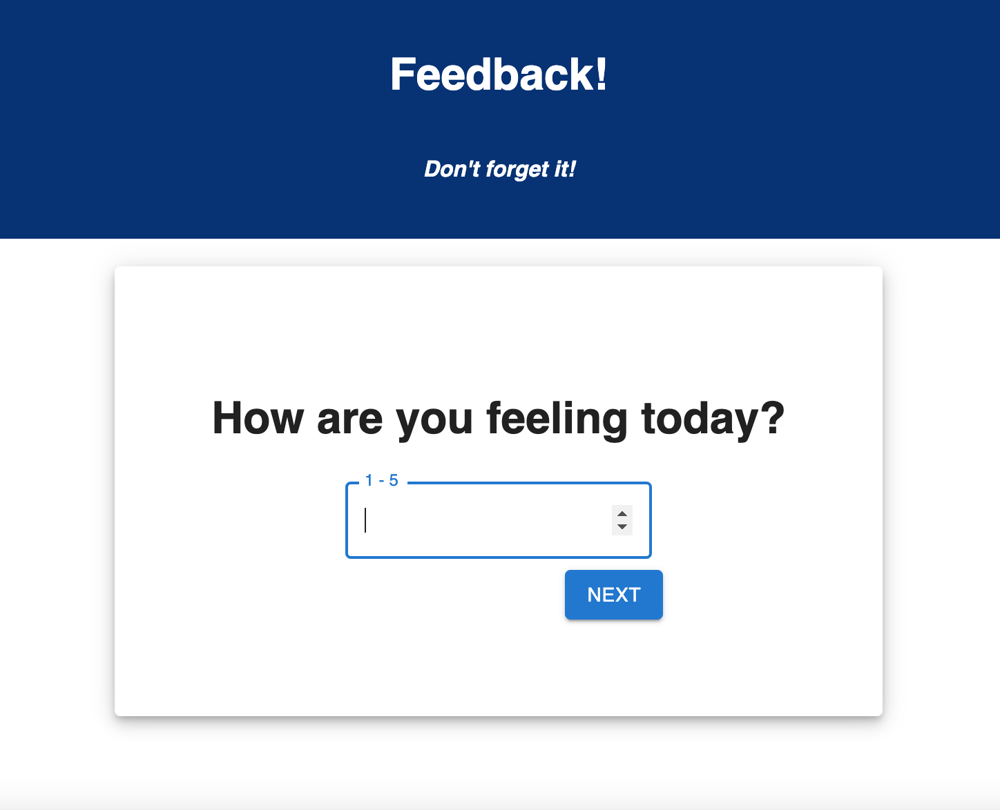

# Feedback Submission App

Imports:
- `npm install redux react-redux`
- `npm install react-router-dom`
- `npm install @mui/material`

Spin up:
- `npm install`
- `npm run server`
- `npm run client`

## Description

This single page application allows users to submit feedback to a database that can later be reviewed. 

Users are asked to answer 4 questions with a value between 1 and 5:

- How are you feeling today?
- How well are you understanding the content?
- How well are you being supported?
- Would you like to leave any comments?

The first 3 pages will only allow values between 1 and 5 and will not allow blank values. The comments page can be left blank if the user chooses to.

The back buttons will bring you to the previous pages if you want to change your values.

The Pages:

- How are you feeling today?

- How well are you understanding the content?

- How well are you being supported?

- Would you like to leave any comments?

- Submission Page

- Thank you Page

- Admin Page

